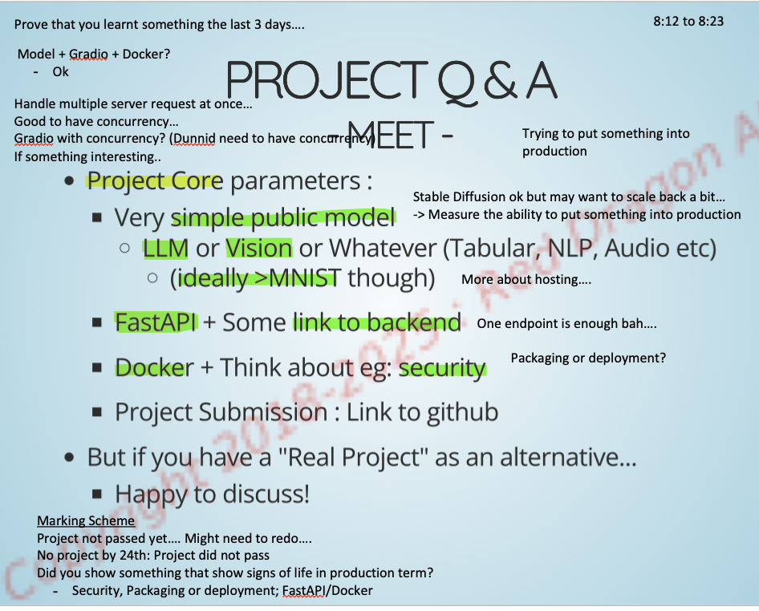

# goh_jia_jun_RDAI

### How to run
1.  Docker Compose the application
   - Run `docker compose up --build` 
   - Works in Windows (or any machine that has nvidia GPU)
   - Use ollama_entrypoint_windows.sh
   - Use ollama_entrypoint.sh for Linux
   - If the following error is observed, please run `dos2unix` command on `ollama_entrypoint_windows.sh` or convert the file using Notepad++
        
         ollama      | 🔴 Retrieve LLAMA3 model...
         ollama      | /entrypoint.sh: line 24: syntax error: unexpected end of file                                                         
         ollama      | /entrypoint.sh: line 2: $'\r': command not found
         ollama      | /entrypoint.sh: line 4: $'\r': command not found                                                                      
         ollama      | /entrypoint.sh: line 7: $'\r': command not found                                                                      
         ollama      | sleep: invalid time interval '5\r'                                                                                    
         ollama      | Try 'sleep --help' for more information.                                                                              
         ollama      | /entrypoint.sh: line 10: $'\r': command not found
   - To install `dos2unix`
         sudo apt-get update
         sudo apt-get install dos2unix
   - Using Notepad ++
      - Install the application here https://notepad-plus-plus.org/downloads/
      - Open `ollama_entrypoint_windows.sh` with Notepad++
      - If it shows Unix (LF), the file is already in Unix format (no changes needed)
      - If it shows **Windows (CR LF)**, the file has **Windows-style line endings**.  
         a. Click on **Edit** in the top menu.  
         b. Navigate to **EOL Conversion**.  
         c. Select **"Convert to UNIX (LF)"**.  
         d. Save the file.  

2. FAST API docs: http://localhost:8000
3. Run the application in http://localhost:8501
4. Upload demo_excel.xlsx (located in home directory)
5. Wait for a while and obtain the results in the processed_excel.xlxs (CHECK name)

Security considerations used in main_app.Dockerfile
1) python:3.10-slim-bookworm is used to reduce attack as they contain fewer packagers
2) Using non-root user reduces access in case of a vulnerability
3) --chown=appuser:appuser Limited permissionjs
4) Removing unecessary files after installation rm -rf /var/lib/apt/lists/*
5) Using healthcheck

Concepts used:
1) FastAPI
2) Docker and Docker compose
3) Ollama + Mistral:7b (GGUF)
4) Streamlit
5) Prompt engineering via LangChain Community